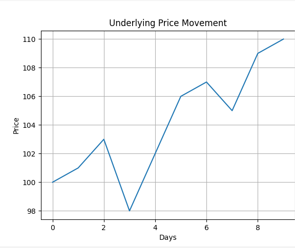

 📈 Structured Product Pricing Simulator


---

 🔍 About the Project

A Python-based simulator to model payoffs of structured equity products like:

- 📉 **Auto-callables**
- 📊 **Reverse convertibles**
- 💡 **Digital options**

It uses historical price data to simulate various risk-return scenarios.

---

 📊 Sample Output

Price movement of the underlying asset:



---

 🛠 How to Run

```bash
 Step 1: Clone the repo
git clone https://github.com/priyankajonnalagadda/structured-product-pricing-simulator.git

 Step 2: Navigate to the project
cd structured-product-pricing-simulator

 Step 3: Install dependencies
pip install pandas matplotlib yfinance

 Step 4: Run the script
cd src
python main.py

